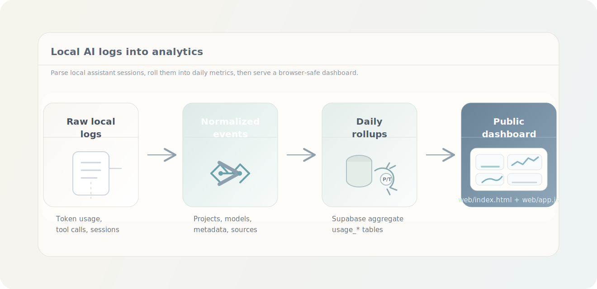
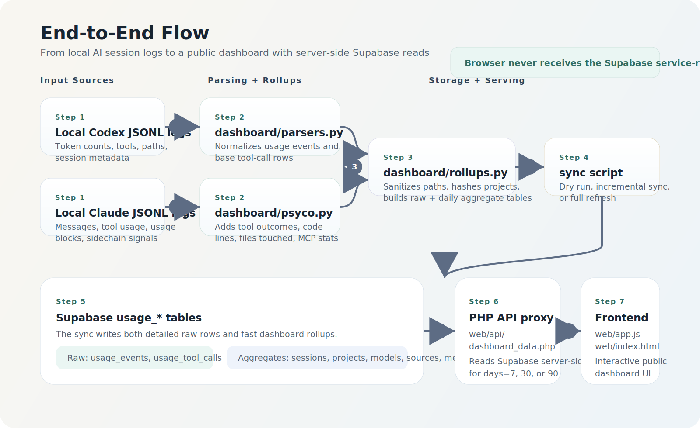
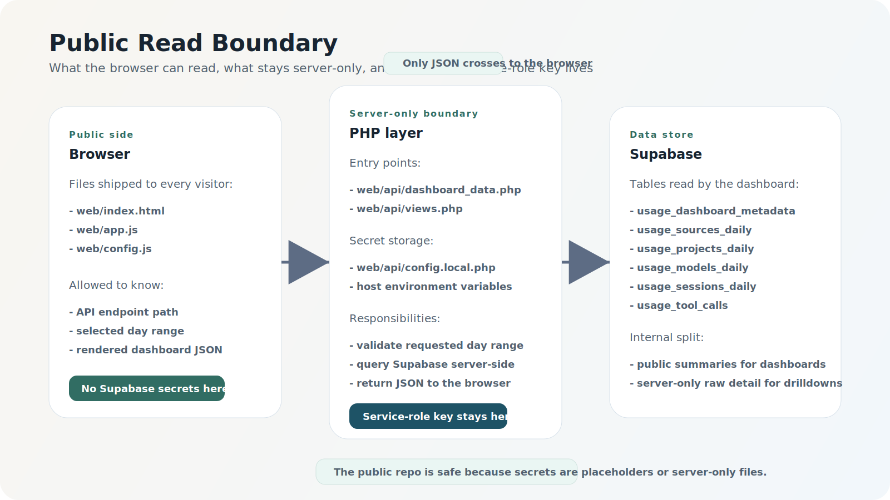

<div align="center">
  <h1>AI Usage Analytics Template</h1>
  <p><strong>Public-safe starter for turning local AI assistant logs into a Supabase-backed dashboard.</strong></p>
  <p>
    <a href="LICENSE"></a>
    
    
    
    
  </p>
  <p>
    <a href="docs/architecture.md"><strong>Architecture</strong></a>
    &nbsp;•&nbsp;
    <a href="docs/api.md"><strong>API Reference</strong></a>
    &nbsp;•&nbsp;
    <a href="docs/security.md"><strong>Security Notes</strong></a>
  </p>
</div>



This repo preserves the real system shape and endpoint names while replacing environment-specific values with placeholders. The end-to-end path stays intact:

1. Read local Codex and Claude JSONL logs
2. Normalize usage and tool-call events
3. Aggregate daily analytics into Supabase `usage_*` tables
4. Serve a public dashboard through PHP endpoints that read from Supabase server-side

## What This Repo Shows

- How local AI logs are parsed into normalized event rows
- How raw rows become daily rollups in Supabase
- How the public dashboard fetches data from `web/api/dashboard_data.php`
- How the browser stays isolated from the Supabase service-role key

## At A Glance

- Reusable ingestion pipeline for Codex and Claude JSONL session logs
- Raw event storage plus daily rollups for projects, models, sources, and sessions
- PHP API layer that keeps Supabase secrets server-side and returns browser-safe JSON
- Static dashboard frontend that reads aggregate analytics without exposing private keys

## End-to-End Flow





## Repo Layout

- `dashboard/`: parsers and rollup helpers
- `scripts/`: sync entrypoints
- `supabase/`: base schema and follow-up migrations
- `web/`: public dashboard template and PHP API proxy
- `docs/`: architecture, API, and security notes
- `examples/`: sanitized sample logs and API payloads

## Quick Start

### 1. Install Python dependencies

```bash
python3 -m venv .venv
source .venv/bin/activate
pip install -r requirements.txt
```

### 2. Configure environment

```bash
cp .env.example .env
```

Fill in:

- `SUPABASE_URL`
- `SUPABASE_SERVICE_ROLE_KEY`
- `CODEX_ROOT`
- `CLAUDE_ROOT`

### 3. Create the Supabase schema

Run the files in this order:

1. `supabase/schema_usage.sql`
2. `supabase/migrations/20260317_hero_metadata_columns.sql`
3. `supabase/migrations/20260328000000_new_metrics_columns.sql`
4. `supabase/migrations/20260316000000_revoke_public_read_sessions_tools.sql`

### 4. Test the log parser without writing

```bash
python scripts/sync_usage_to_supabase.py --dry-run
```

### 5. Sync recent data into Supabase

```bash
python scripts/sync_usage_to_supabase.py --days-back 90
```

### 6. Deploy the public dashboard

Upload `web/` to your PHP-capable host, then:

1. Review `web/config.js` and adjust browser-safe values if needed
2. Copy `web/api/config.local.example.php` to `web/api/config.local.php`
3. Fill in placeholder values server-side only
4. Keep `web/api/.htaccess` deployed

The browser calls:

- `GET /api/dashboard_data.php?days=30`
- `GET /api/views.php`

Only the PHP layer talks to Supabase with the service-role key.

## Key Tables

- `usage_events`: normalized token usage events
- `usage_tool_calls`: normalized tool calls with optional success/error hints
- `usage_sessions_daily`: per-session daily rollups
- `usage_projects_daily`: per-project daily rollups
- `usage_models_daily`: per-model daily rollups
- `usage_sources_daily`: per-source daily rollups
- `usage_dashboard_metadata`: global dashboard summary row
- `usage_sync_runs`: optional sync audit trail

## Public API Surface

- `GET /api/dashboard_data.php?days=<1..365>`
- `GET /api/views.php`

See:

- [Architecture](docs/architecture.md)
- [API Reference](docs/api.md)
- [Security Notes](docs/security.md)

## License

Licensed under the MIT License. See [LICENSE](LICENSE).
