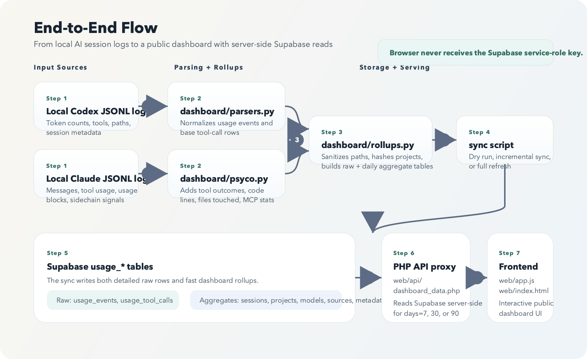
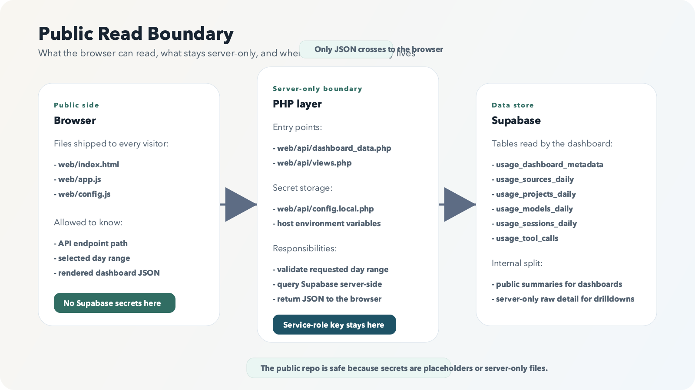

# Architecture

## Goal

Capture local AI coding activity, store it in a queryable analytics warehouse, and publish a safe public dashboard without exposing raw credentials in browser code.

## Data Sources

The pipeline reads JSONL logs from two local roots:

- `CODEX_ROOT`
- `CLAUDE_ROOT`

The parser layer extracts:

- token usage events
- tool invocations
- session-level conversation and code-writing metrics

## Request Lifecycle

1. Local Codex and Claude JSONL files are parsed into normalized event rows.
2. `dashboard/rollups.py` sanitizes paths, hashes project names, and prepares write-safe records.
3. `scripts/sync_usage_to_supabase.py` upserts raw and aggregate tables into Supabase.
4. `web/api/dashboard_data.php` reads a selected time window from Supabase on the server.
5. `web/app.js` renders the returned JSON payload into the public dashboard.

## Processing Layers

### 1. Log parsing

Files:

- `dashboard/parsers.py`
- `dashboard/psyco.py`

Responsibilities:

- parse Codex and Claude session logs
- extract normalized usage rows
- extract tool-call rows
- infer extra metrics such as user-message counts, code-line counts, file touches, MCP usage, and tool success/failure hints

### 2. Normalization and rollups

File:

- `dashboard/rollups.py`

Responsibilities:

- sanitize file paths before storage
- normalize project names
- generate stable hashes and row keys
- merge raw tool-call rows with enriched tool outcomes
- build daily tables for sessions, projects, models, and sources
- build a single metadata row for the dashboard hero/state summary

### 3. Sync orchestration

File:

- `scripts/sync_usage_to_supabase.py`

Responsibilities:

- read local logs
- call parser and rollup helpers
- optionally dry-run for local inspection
- upsert raw and aggregated rows into Supabase
- support incremental and full-refresh modes

### 4. Public web read path

Files:

- `web/api/dashboard_data.php`
- `web/app.js`
- `web/index.html`

Responsibilities:

- accept `days` as a dashboard time-window input
- query Supabase server-side
- return JSON payloads to the browser
- keep the Supabase service-role key off the client

## Table Design

### Raw tables

- `usage_events`
- `usage_tool_calls`

These preserve normalized per-event and per-tool details used for deeper insights and server-side dashboard drilldowns.

### Aggregated tables

- `usage_sessions_daily`
- `usage_projects_daily`
- `usage_models_daily`
- `usage_sources_daily`
- `usage_dashboard_metadata`

These drive most dashboard summaries and reduce read cost.

### Operational table

- `usage_sync_runs`

This can be used to audit sync status, row counts, warnings, and failures.

## Why There Are Both Raw and Aggregate Tables

- Raw tables preserve tool-level and event-level detail for drilldowns and server-side analytics.
- Aggregate tables keep the public dashboard fast and simple to query.
- The metadata row gives the frontend one compact place to read overall totals and date bounds.

## Why the Browser Does Not Read Supabase Directly

The public dashboard needs some server-side detail that should not be openly queryable from the browser, especially session-level and tool-level detail. The template keeps those reads in `web/api/dashboard_data.php`, where the service-role key stays server-side.

The browser only sees JSON returned by the PHP proxy.
